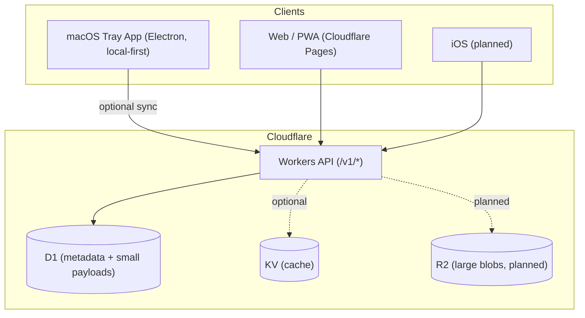
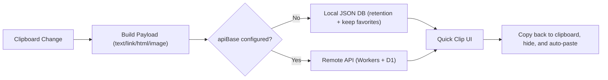

# Pastyx

[](https://github.com/sponsors/leeguooooo)

Open-source, free clipboard utility toolkit.

中文提示：这是一个独立的开源工具，用于剪贴板历史、截图和录屏。
免费可用、代码透明，还支持按需自建同步服务。
我们与官方无隶属关系。
我们不是 pasteapp，不是 paste 的盗版，且是专注开源的 Pastyx。
English note: This is an independent open-source project. We are not pasteapp, not a pirated copy of Paste, and we are Pastyx, focused on open-source development.

Pastyx is a local-first clipboard toolkit for macOS (clipboard history, screenshot, and screen recording), with an optional Cloudflare backend for cross-device sync.

- macOS: tray app, no main window, quick panel
- Local-first: no URL required; empty URL means local-only (no remote sync)
- Optional sync: Cloudflare Workers + D1 (and R2 later for large blobs)

## Quick Start

1. Download the latest build from GitHub Releases (macOS `x64` / `arm64`).
2. Open app, use the global hotkey to show the quick panel.
3. Optional: configure `API Base` to enable cross-device sync.

## macOS Notes

- Auto-paste requires **Accessibility** permission (because we simulate `Cmd+V`).
  - Dev mode: enable Accessibility for `Electron`.
- Release build: enable Accessibility for `Pastyx`.
- Builds are **unsigned / not notarized** for now.
  - `v0.1.3+` adds a minimal ad-hoc signature to avoid the common “App is damaged” error.
  - For a polished distribution, add Apple Developer ID signing + notarization.

## Screenshot


## Architecture





## Keywords / 关键词

These are here for discovery (GitHub + search engines):

- clipboard alternative
- independent clipboard toolkit alternative
- open clip toolkit
- open source clipboard manager
- clipboard history
- clipboard manager macOS
- clipboard sync
- snippets
- tag/favorite/search clipboard
- PWA clipboard manager
- Cloudflare Workers clipboard

中文关键词：

- 开源工具替代方案
- 剪贴板管理器
- 剪贴板历史
- macOS 剪贴板工具
- 多设备同步
- 标签 / 收藏 / 搜索
- 开源剪贴板工具
- Open toolkit
- 破解类工具替代方案
- 第三方替代品说明（非官方）

## Features

- Types: `text` / `link` / `html` / `image`
- macOS:
- Tray app; Quick panel (no main window)
  - Select a clip to copy, hide, and auto-paste back to your previous app
  - Local-first retention: `30d` / `180d` / `365d` / `forever` (favorites are kept)
- Sync (optional): Cloudflare Workers + D1
  - Search, favorites, tags
  - Multi-device sync via `clientUpdatedAt` (LWW)

## Repo Structure

```txt
apps/
  api/          # Cloudflare Worker API
  web/          # Cloudflare Pages frontend
  macos/        # Electron macOS desktop app (clipboard, screenshot, recording)
packages/
  shared/       # Shared types/contracts
docs/
  architecture.md
  todo-roadmap.md
```

## Local Development

Create D1 once:

```bash
cd apps/api
wrangler d1 create paste-db
# Fill database_id back into apps/api/wrangler.toml
wrangler d1 migrations apply paste-db --local
cd ../..
```

Optional KV cache:

```toml
# apps/api/wrangler.toml
[[kv_namespaces]]
binding = "CACHE"
id = "<your-kv-namespace-id>"
```

Cloudflare SSO auth (Web):

```toml
[vars]
# Recommended production mode.
AUTH_MODE = "sso"
SSO_ISSUER = "https://account.misonote.com"
SSO_CLIENT_ID = "misonote-paste-web"
# Optional tenant entitlement check:
# SSO_ENTITLEMENT_TENANT_ID = "tenant-misonote"
# SSO_REQUIRED_ENTITLEMENT_KEY = "membership.all_apps"

# Legacy header mode on/off. Keep "0" in production.
ALLOW_HEADER_IDENTITY = "0"
```

Web app env (optional, recommended to set explicitly):

```bash
# apps/web/.env.local
VITE_SSO_ISSUER=https://account.misonote.com
VITE_SSO_CLIENT_ID=misonote-paste-web
# Fixed callback allowlist path used by web:
# https://app.misonote.com/paste/auth/callback
# https://paste.misonote.com/auth/callback
```

App portal subpath build (`https://app.misonote.com/paste`):

```bash
# apps/web subpath config
PASTE_SITE_URL=https://app.misonote.com/paste
VITE_BASE_PATH=/paste/
VITE_API_BASE=/paste/v1
VITE_SSO_REDIRECT_PATH=/paste/auth/callback
VITE_SSO_POST_AUTH_PATH=/paste/
```

Build command for portal subpath:

```bash
cd apps/web
npm run build:app-subpath
```

Client split (recommended):

- Web: `misonote-paste-web`
- macOS: `misonote-paste-macos`
- Do not reuse one `client_id` across web and desktop loopback callbacks.

Run dev:

```bash
npm install
npm run dev:api
npm run dev:web
npm run dev:macos
```

API smoke test:

```bash
npm run test:api:smoke
```

## Sync Setup (macOS)

By default `API Base` is empty, so the app is **local-only**.

To enable sync, set `API Base` to one of:

- `https://app.misonote.com/paste/v1` (portal proxy route)
- `https://pasteapi.misonote.com/v1` (direct Worker domain)

Then keep `User ID` consistent across devices.

Desktop SSO env (optional):

```bash
# apps/macos/.env.local
PASTE_SSO_ISSUER=https://account.misonote.com
PASTE_SSO_CLIENT_ID=misonote-paste-macos
```

## API

Web auth endpoints:

- `POST /v1/auth/sso/token` (exchange authorization code/refresh token with SSO issuer)
- `GET /v1/auth/me` (current session)
- `POST /v1/auth/logout` (clear local auth state/cookies)

Identity for business APIs:

- Web (signed-in): `Authorization: Bearer <SSO access token>` + `x-device-id`
- Legacy mode only: `x-user-id` + `x-device-id` headers

Endpoints:

- `GET /v1/health`
- `GET /v1/clips` (supports `q`, `tag`, `favorite`, `cursor`, `limit`, `lite=1`)
- `GET /v1/clips/:id`
- `POST /v1/clips`
- `PATCH /v1/clips/:id`
- `DELETE /v1/clips/:id` (soft delete)
- `GET /v1/tags`
- `POST /v1/tags`
- `DELETE /v1/tags/:id`
- `GET /v1/sync/pull?since=...&limit=...`
- `POST /v1/sync/push` (LWW by `clientUpdatedAt`)

Notes:

- `lite=1` makes list responses omit heavy fields (HTML/image) for faster browsing.
- Images currently use `imageDataUrl` stored in D1 (max ~1_500_000 chars). Larger blobs will move to R2.

Example:

```bash
curl -X POST http://127.0.0.1:8787/v1/clips \
  -H 'content-type: application/json' \
  -H 'x-user-id: u_demo' \
  -H 'x-device-id: mac_01' \
  -d '{
    "type":"text",
    "content":"hello paste",
    "tags":["work","snippet"],
    "isFavorite":true
  }'
```

## Deploy

```bash
npm run deploy
# same as:
npm run deploy:prod
# or deploy individually:
npm run deploy:api
npm run deploy:web
npm run deploy:landing
```

For forks: `apps/api/wrangler.toml` includes `misonote.com` routes. Replace them with your own domain/routes (or remove `routes` to use `*.workers.dev`).

## Docs

- Architecture: `docs/architecture.md`
- Roadmap: `docs/todo-roadmap.md`
- API contract: `docs/api-contract.md`
- Frontend handoff: `docs/frontend-handoff.md`
- macOS roadmap: `docs/macos-roadmap.md`

## Trademark Note

This project is an independent, open-source toolkit. 我们与官方无隶属关系。
We are not affiliated with any official clipboard vendor.

## Support / 赞助开发

开源不易。如果这个项目对你有帮助，欢迎 Star 或赞助支持作者继续维护。

- GitHub Sponsors: https://github.com/sponsors/leeguooooo
- 微信 / 支付宝赞赏码见下方

[](https://github.com/sponsors/leeguooooo)

<div align="center">
  
  
</div>

## Release

This repo uses GitHub Releases.

- Tag format: `vX.Y.Z` (example: `v0.1.8`)
- GitHub Actions will build:
  - macOS Intel (x64): `.dmg` + `.zip`
  - macOS Apple Silicon (arm64): `.dmg` + `.zip`
  - Windows (x64): installer `.exe` + `.zip`
- Auto-update metadata (for `electron-updater`): `latest*.yml` + `*.blockmap`

Create a release:

```bash
git tag -a v0.1.9 -m "v0.1.9"
git push origin v0.1.9
```
