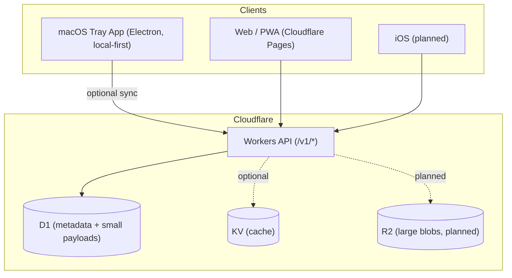
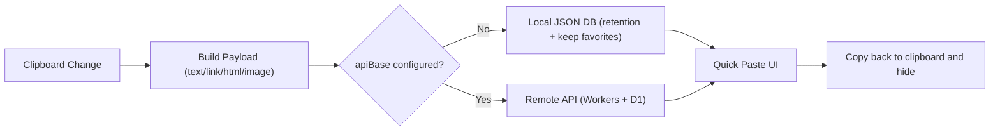

# paste

Open-source, free **Paste.app alternative**.

`paste` is a local-first clipboard manager for macOS (Paste-style), with an optional Cloudflare backend for cross-device sync.

- macOS: tray app, no main window, Quick Paste panel
- Local-first: no URL required; empty URL means local-only (no remote sync)
- Optional sync: Cloudflare Workers + D1 (and R2 later for large blobs)

## Architecture





## Keywords / 关键词

These are here for discovery (GitHub + search engines):

- paste alternative
- Paste.app alternative
- open paste
- open source clipboard manager
- clipboard history
- clipboard manager macOS
- clipboard sync
- snippets
- tag/favorite/search clipboard
- PWA clipboard manager
- Cloudflare Workers clipboard

中文关键词：

- Paste 替代
- 剪贴板管理器
- 剪贴板历史
- macOS 剪贴板工具
- 多设备同步
- 标签 / 收藏 / 搜索
- 开源 Paste

## Features

- Web/PWA: browse, search, tags, favorites, sync
- API: `text`/`link`/`html`/`image` (image uses Data URL in D1 for now; about 1_500_000 chars limit; large blobs will move to R2)
- macOS: Electron tray app; default local-only; retention: 30 days / 6 months / 1 year / forever (favorites are kept)

## Repo Structure

```txt
apps/
  api/          # Cloudflare Worker API
  web/          # Cloudflare Pages frontend
  macos/        # Electron macOS desktop app (Paste-style)
packages/
  shared/       # Shared types/contracts
docs/
  architecture.md
  todo-roadmap.md
```

## Local Development

Create D1 once:

```bash
cd apps/api
wrangler d1 create paste-db
# Fill database_id back into apps/api/wrangler.toml
wrangler d1 migrations apply paste-db --local
cd ../..
```

Optional KV cache:

```toml
# apps/api/wrangler.toml
[[kv_namespaces]]
binding = "CACHE"
id = "<your-kv-namespace-id>"
```

Run dev:

```bash
npm install
npm run dev:api
npm run dev:web
npm run dev:macos
```

API smoke test:

```bash
npm run test:api:smoke
```

## API (No Auth Phase)

Identity via headers (until auth is added):

- `x-user-id: your-user-id`
- `x-device-id: your-device-id`

Endpoints:

- `GET /v1/health`
- `GET /v1/clips` (supports `q`, `tag`, `favorite`, `cursor`, `limit`)
- `POST /v1/clips`
- `PATCH /v1/clips/:id`
- `DELETE /v1/clips/:id` (soft delete)
- `GET /v1/tags`
- `POST /v1/tags`
- `DELETE /v1/tags/:id`
- `GET /v1/sync/pull?since=...&limit=...`
- `POST /v1/sync/push` (LWW by `clientUpdatedAt`)

Example:

```bash
curl -X POST http://127.0.0.1:8787/v1/clips \
  -H 'content-type: application/json' \
  -H 'x-user-id: u_demo' \
  -H 'x-device-id: mac_01' \
  -d '{
    "type":"text",
    "content":"hello paste",
    "tags":["work","snippet"],
    "isFavorite":true
  }'
```

## Deploy

```bash
npm run deploy:api
npm run deploy:web
```

## Docs

- Architecture: `docs/architecture.md`
- Roadmap: `docs/todo-roadmap.md`
- API contract: `docs/api-contract.md`
- Frontend handoff: `docs/frontend-handoff.md`
- macOS roadmap: `docs/macos-roadmap.md`

## Trademark Note

Paste is a product name owned by its respective owners. This project is an independent, open-source alternative.
